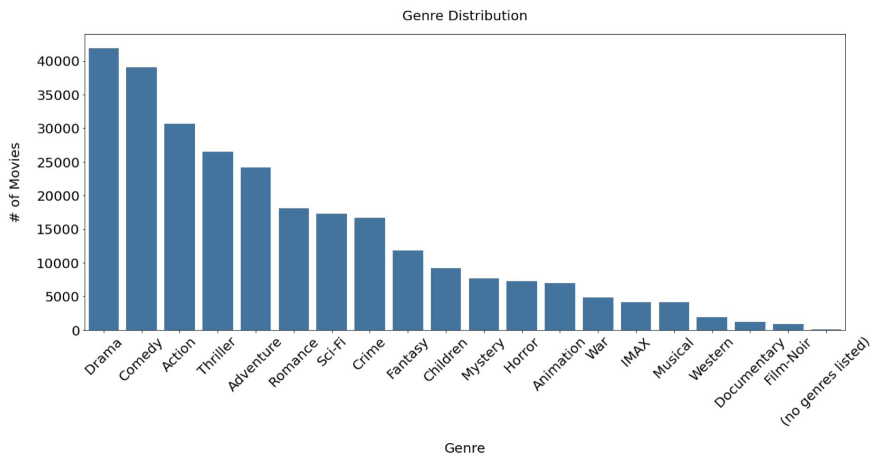

# Flatiron Phase 4 - Final Project by Vi Bui
# Movie Recommendation System

# Overview

Vi(sion) Studios, a new streaming service, is looking to launch a concept called "Digital Cinema Night" where customers can build a "Cinema Night" around specific movies. They've hired us to build a Recommendation System in order to launch this concept.  

## Data, Methodology, and Analysis   

Data source: Popular MovieLens dataset which captures Movies, Ratings, Genres, and Year. 

More about the data from MovieLens: “Users were selected at random for inclusion. All selected users had rated at least 20 movies. No demographic information is included. Each user is represented by an id, and no other information is provided.”

There are 9724 unique entries and 610 unique users in the data. 

**Models Built:** 

1. Singular Vector Decomposition Model (SVD)
2. k-Nearest Neighbor Baseline Model (KNNB)
3. Non-Negative Matrix Factorization Model (NMF)

**Features included and created:**
1. Movie ID (included)
2. User ID (included) 
3. Ratings (included)
4. Year (cleaned & created)
5. Genre (cleaned & created) 
6. Ratings Count (created) 

 

## BUSINESS VALUE

  

## OBSERVATIONS ABOUT THE DATA
**Most movies are from the 1990s to the early 2000s (key Millennial time period)**

 

**The most popular genres: Drama, Comedy, and Action**

 

**Users tend to rate in whole numbers and 4 (out of 5) is the most popular rating**

 

# Models & Metrics 
## We ran three models and used RMSE (root mean square error), which tells us how close our model's predicted ratings are to actual ratings. 

 
While all models showed strong results and predictions, we chose the Singular Value Decomposition (SVD) model, which had an RMSE of 0.86, meaning our predictions, on average, were 0.86 points away from actual ratings. 

 

 

 # **RESULTS & RECOMMENDATIONS** 

## Summary of recommendations

**Use SVD Model to launch**
- While all models showed improvement after tuning and KNN Baseline and NMF Models have low RMSEs (predictions are close to actual ratings), in order to reduce the risk of over-fitting, the SVD Model - with a strong RMSE of 0.86 - is recommended 

**Test for 6 months and re-evaluate**
- Revisit KNN Baseline and/or NMF Models if necessary 

**Launch concept with Millennial (or Millennial-enthusiast) audience**
- Movies leaned toward 1990s to early 2000s 
- Opportunity to build early loyalty with an influential demographic

 

## **FUTURE WORK**
- Build functionality around genre and year choices 
- Extend audience beyond initial millennial focus 
- Expand dataset with more movie choices & continually refine “Digital Cinema Night” system to make stronger recommendations to users
- Build exquisite user interface 

  

## BRINGING THE VI(SION) TO LIFE
## DIGITAL CINEMA NIGHT!!
 

 

# Repository Structure

- Images 
- README.me
- Vi_Bui_Phase4_Project_FINAL_Surprise.ipynb
- Vi_Bui_Phase4_Project_FINAL_Jupyter Notebook.pdf
- Vi_Bui_Phase4_Project_FINAL_Presentation.pdf
- viiiiiiiiiii_Flatiron_Phase4_Final_Vi_Bui_ Phase 4 Project - Recommendation System.pdf
